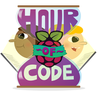

# Kids Ruby quiz game

Make your own quiz game with Kids Ruby and your Raspberry Pi.

## Requirements

As well as a Raspberry Pi with an SD card loaded with Raspbian, you'll also need:

### Software

- Kids Ruby

For more information on checking you have these packages installed, and how to install them, see the [software installation](software.md) page.

## Worksheet

- [Go to the worksheet](worksheet.md)

## Licence

Unless otherwise specified, everything in this repository is covered by the following licence:

***Kids Ruby Quiz Game*** by [Les Pounder](https://github.com/lesp) and the [Raspberry Pi Foundation](http://www.raspberrypi.org) is licensed under a [Creative Commons Attribution 4.0 International Licence](http://creativecommons.org/licenses/by-sa/4.0/).
