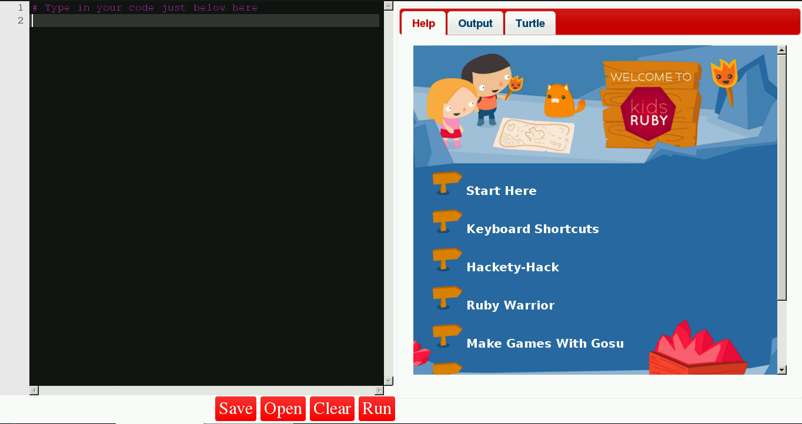
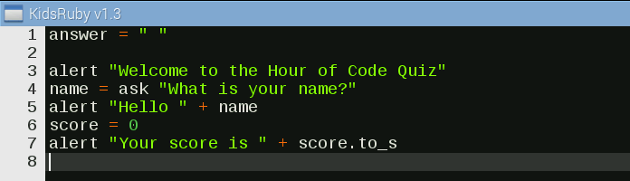

## Introduction, welcoming the player

- Launch the Kids Ruby application by selecting it from the menu; in a few seconds the application will be ready to use.



- Click on the **Clear** button and select **Yes** on the window that appears.

- Now, let's create a variable.

  A variable is a container in which we can store data. Think of it as an empty box; we can put anything inside it and then name it for later use.

  The following code creates a variable called `answer` and stores a blank value inside it. Type this into the Kids Ruby window. The reason for this will be explained later in the project.

  ```ruby
  answer = " "
  ```

- Now let's make a welcome message for the player. Use `alert` to create a pop-up box that welcomes the player to the game:

  ```ruby
  alert "Welcome to the Hour of Code Quiz"
  ```

- Next, create a new variable called `name`. This is used to store the answer to a question that we ask the player; in this case the question is "What is your name?":

  ```ruby
  name = ask "What is your name?"
  ```

- For the next line of the quiz greet the player by their name, which has has been saved as the variable `name`. Let's do something rather clever with this variable. Use `alert` to create another pop-up box that joins "Hello " and the player's name together with a plus symbol. This is called concatenation, which means the process of joining character strings end-to-end. For example, the concatenation of "snow" and "ball" is "snowball".

  ```ruby
  alert "Hello " + name
  ```

- Next, create a new variable called `score` which will contain the player's score. The initial value stored is zero, which is known in programming as an integer. An integer is a number that can be written without a decimal place, such as 1, 5 and 9.

  ```ruby
  score = 0
  ```

- Finally, let's make another alert showing the player their score, which at the start of the game is always zero. You can use concatenation again to join "Your score is " to their actual score. But there is a problem, because concatenation can only join strings together; so as the score is an integer the two cannot be joined. To join them together we must temporarily change the score to a string; this is done via `score.to_s`. A string is a sequence of characters; for example, "Hello" is a string.

  ```ruby
  alert "Your score is " + score.to_s
  ```



