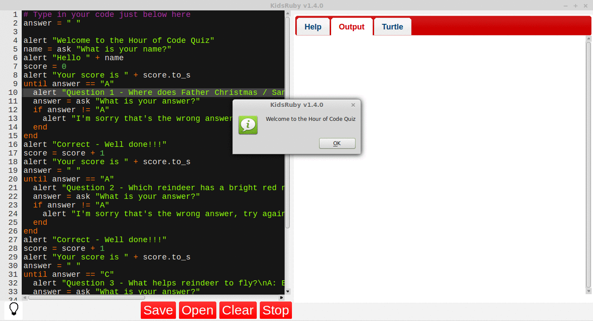

## Game over and final score

- For the end of the quiz, create a final `alert` in the same way as before. This tells the player their final score and announces that the game is now over.

  ```ruby
  alert "Congratulations you scored "+score.to_s+"\n GAME OVER"
  ```

- Remember to save your work! When you are ready, click on the **Run** button to start your quiz game. Your program should look like this:

  

