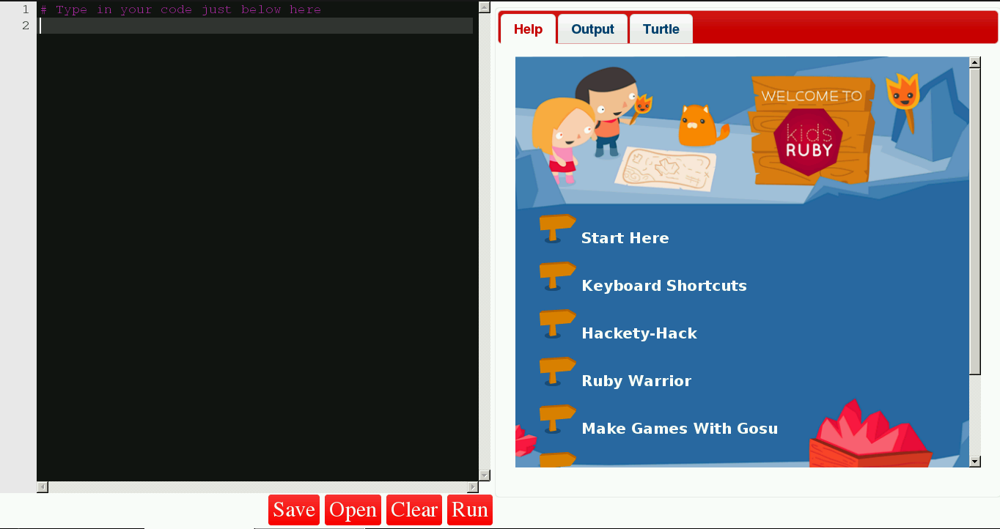

# Software installation

You'll need to make sure you have the following packages installed to proceed. You'll also need to be online to install packages.

To use Ruby on your Raspberry Pi, we will need to install a special version called "Kids Ruby". This version is ideally suited for this project and it can be installed really quickly. To install Kids Ruby on your Pi you will need to open a terminal window; you can do this by clicking on **Menu** then **Accessories** and selecting **Terminal**.

To download the file for installation on your Pi, type the following into the terminal and press **enter**:

```bash
wget http://goo.gl/Py9pql --no-check-certificate -O kidsruby-1.3.2-armv6l.deb
```

Once downloaded, type the following into the terminal and press **enter**:

```bash
sudo dpkg -i kidsruby-1.3.2-armv6l.deb
```


This will install Kids Ruby on your Pi. Once it has been installed, it will be available via the Programming menu.


Launch the Kids Ruby application by selecting it from the menu; in a few seconds the application will be ready to use.



Kids Ruby uses a simple layout with the screen split into two large sections:

- A large black box, where our Ruby code is typed.
- A large box with shortcuts to built-in ideas and projects, as well as the output from any code that is written.

Underneath the large black box are a few buttons:

- Save: Saves your project; it's really important to save your work regularly.
- Open: Opens a project that has been saved to your computer.
- Clear: Clears the code in the black box; use with caution.
- Run: Runs the code in the black box.
