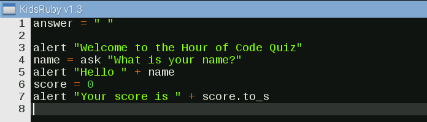
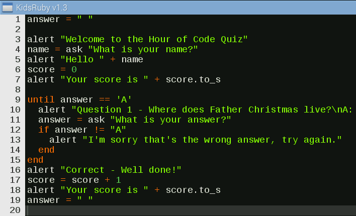

# Kids Ruby Quiz

Ruby is an easy to learn general-purpose programming language, and it's also used to create music in Sonic Pi. In this tutorial, you will create a quiz using a special application called Kids Ruby. You will need to install kids ruby before you start this activity. See the [software installation instructions here](software.md)

## Creating the sequence

The quiz is split into three sections of code:

- An introduction
- Questions
- Game over & final score

So let's step through each of these sections and understand how they work.

## Introduction, welcoming the player

1. Launch the Kids Ruby application by selecting it from the menu; in a few seconds the application will be ready to use.


1. Click on the **Clear** button and select **Yes** on the window that appears.

1. Now, let's create a variable.

  A variable is a container in which we can store data. Think of it as an empty box; we can put anything inside it and then name it for later use.

  The following code creates a variable called `answer` and stores a blank value inside it. Type this into the Kids Ruby window. The reason for this will be explained later in the project.

  ```ruby
  answer = " "
  ```

1. Now let's make a welcome message for the player. Use `alert` to create a pop-up box that welcomes the player to the game:

  ```ruby
  alert "Welcome to the Hour of Code Quiz"
  ```

1. Next, create a new variable called `name`. This is used to store the answer to a question that we ask the player; in this case the question is "What is your name?":

  ```ruby
  name = ask "What is your name?"
  ```

1. For the next line of the quiz greet the player by their name, which has has been saved as the variable `name`. Let's do something rather clever with this variable. Use `alert` to create another pop-up box that joins "Hello " and the player's name together with a plus symbol. This is called concatenation, which means the process of joining character strings end-to-end. For example, the concatenation of "snow" and "ball" is "snowball".

  ```ruby
  alert "Hello " + name
  ```

1. Next, create a new variable called `score` which will contain the player's score. The initial value stored is zero, which is known in programming as an integer. An integer is a number that can be written without a decimal place, such as 1, 5 and 9.

  ```ruby
  score = 0
  ```

1. Finally, let's make another alert showing the player their score, which at the start of the game is always zero. You can use concatenation again to join "Your score is " to their actual score. But there is a problem, because concatenation can only join strings together; so as the score is an integer the two cannot be joined. To join them together we must temporarily change the score to a string; this is done via `score.to_s`. A string is a sequence of characters; for example, "Hello" is a string.

  ```ruby
  alert "Your score is " + score.to_s
  ```



## Asking questions and working with user input

A quiz isn't much fun without questions, but once we add some how do we know if the player has answered them correctly?

In programming you can compare an answer given by the player to the correct answer; until the player's answer is correct they cannot progress through the quiz. In Ruby you can repeat a sequence, or loop, until a certain condition is met. In this case you ask a question to the user and give them three possible answers, labelled A, B, and C. 

1. Underneath your code so far, type the following which will continue to loop until the player chooses **A**:

  ```ruby
  until answer == "A"
  ```

1. As you have set the answer condition, now you must create the questions with more `alert`s. You will see an **\n** in the question text which is an instruction to create a new line underneath, similar to when you press Enter on your keyboard.

  ```ruby
    alert "Question 1 - Where does Father Christmas / Santa Claus live?\nA: North Pole. B: Santa Monica. C: Cambridge"
  ```
 
1. You now need to capture the players answer; to do that use `ask` to capture their answer and store it as a variable called `answer`. You'll remember that we created this variable at the start of the quiz with a blank value inside. You did this so that the program would progress. If you didn't do this, the quiz would stop before it asked the first question.
 
  ```ruby
    answer = ask "What is your answer?"
  ```
 
1. Now you need to compare the answer given against the correct answer, using an **if** statement. An if statement is conditional: if the condition is met an action is taken.
 
 In this quiz you ask 'if the answer given by the user is not the same as "A"' using this line of code:
 
  ```ruby
    if answer != "A"
  ```
 
1. So if the answer given by the player is not the same as the answer that we expected, then an alert is created informing the player that their answer is wrong and that they should try again:
 
  ```ruby
      alert "I'm sorry that's the wrong answer, try again"
    end
  end
  ```

1. If the player answers correctly, they will skip past the previous loop and will carry on from this point. Create a new `alert` that congratulates the player on their correct answer. Next, increase their score by one point and tell the player their current score. Finally, reset the `answer` variable, ready for the next question.

  ```ruby
  alert "Correct - Well done!!!"
  score = score + 1
  alert "Your score is " + score.to_s
  answer = " "
  ```
1. Save your file by clicking on the **Save** button and name your file `Quiz.rb`. Then click **Run** to test to see if it works.

  

## Adding more questions

1. Questions 2 and 3 follow exactly the same pattern as Question 1; the code below is simply changed so that we can ask different questions. Add it underneath your code so far:

```ruby
until answer == "A"
  alert "Question 2 - Which reindeer has a bright red nose?\nA: Rudolph. B: Prancer. C: Vixen"
  answer = ask "What is your answer?"
  if answer != "A"
    alert "I'm sorry that's the wrong answer, try again"
  end
end
alert "Correct - Well done!!!"
score = score + 1
alert "Your score is " + score.to_s
answer = " "
until answer == "C"
  alert "Question 3 - What helps reindeer to fly?\nA: Burgers. B: Chicken. C: Magic dust"
  answer = ask "What is your answer?"
  if answer != "C"
    alert "I'm sorry that's the wrong answer, try again"
  end
end
alert "Correct - Well done!!!"
score = score + 1
alert "Your score is " + score.to_s
answer = " "
```

## Game over and final score

1. For the end of the quiz, create a final `alert` in the same way as before. This tells the player their final score and announces that the game is now over.

  ```ruby
  alert "Congratulations you scored "+score.to_s+"\n GAME OVER"
  ```

1. Remember to save your work! When you are ready, click on the **Run** button to start your quiz game. Your program should look like this:

  

## What next?

- If you would like to learn more about Kids Ruby, why not explore the great games and ideas already included via Hackety-Hack, Ruby Warrior or Make Games with Gosu?
- Why not get creative with Ruby in [Sonic Pi](https://www.raspberrypi.org/learning/getting-started-with-sonic-pi/)

